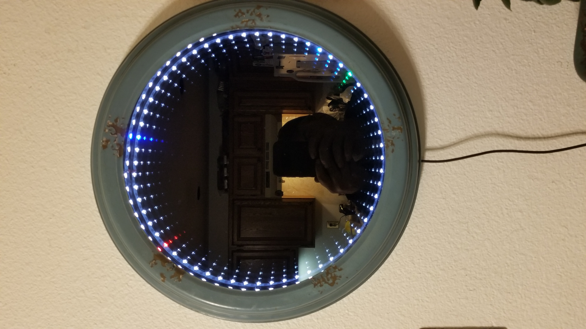

# Neopixel-Infinity-LED-Clock
An Infinity mirror clock I created using 60 neopixels in a strip.

This clock is using an Adafruit Feather 32 V2 and a DS3132 Feather wing.

# Features:

    Very quiet operation.
    Chimes via pulsing the entire strip. No sound.
    DS3231 real time clock for accurate time-keeping ability.
    NTP sync'ed time for the RTC.
    Outside temperature via Weather update from openweathermap.org for the the background color.
    Dual-core usage to provide a more stable operation.

# Libraries needed:

    Adafruit_NeoPixel - Neopixel library by Adafruit
    TimeLib - Time library by Michael Margolis v1.6.1
    WiFi - WiFi support
    WiFiUdp - Udp operations
    WiFiManager - Configuration of a wifi connection
    WiFiClient - Support for weather data
    HTTPClient - Support for weather data
    Arduino_JSON - Support weather data
    ArduinoOTA - OTA support
    RTClib - Real time clock support by Adafruit
